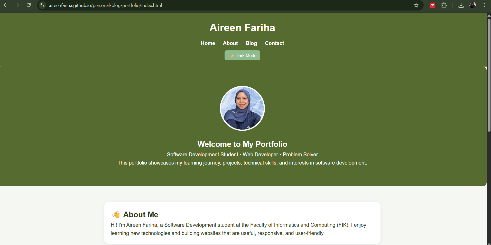
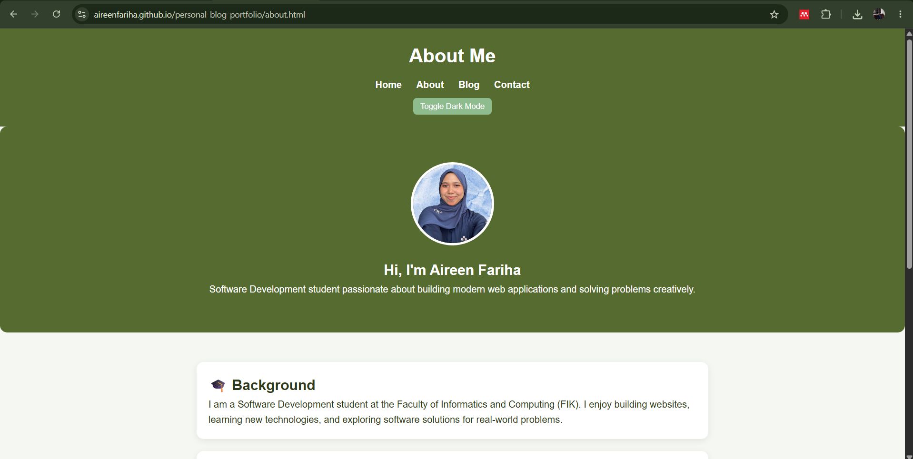
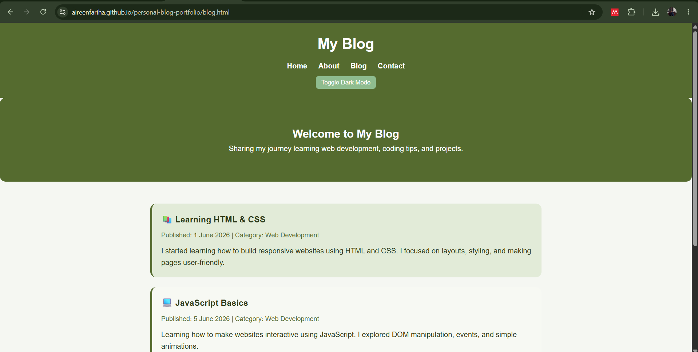
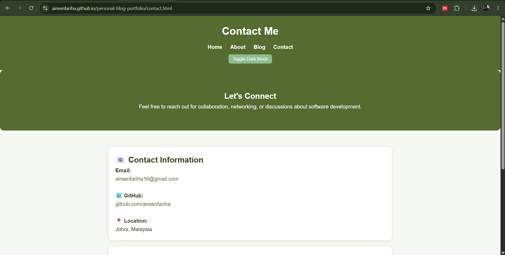

# Personal Blog Portfolio

## Description
This project is a personal blog portfolio website developed for the CSD34203 Special Topics in Software Development course. The website introduces my background, skills, blog posts, and contact information through a clean and responsive user interface.

## Features
- Home page with personal introduction
- About page
- Blog page with sample blog posts
- Contact page
- Dark mode toggle
- Responsive layout for different screen sizes

## Technologies Used
- HTML5
- CSS3
- JavaScript

## Screenshots

### Home Page

### About Page

### Blog Page

### Contact Page

## How to Run
1. Download or clone this repository.
2. Open the project folder.
3. Open `index.html` in a web browser.

## Demo
GitHub Pages Link:
(https://aireenfariha.github.io/personal-blog-portfolio/)

## Author
Nur Aireen Fariha